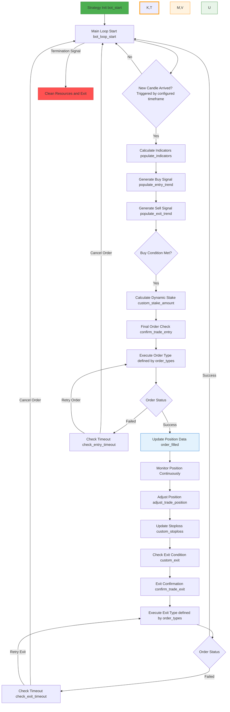

# 📘 「Revealed」Full Lifecycle of a Freqtrade Strategy – Build a Stable and Profitable Crypto Trading Bot!
> This article was produced by the Quantitative Trading Lab at [https://www.itrade.icu](https://www.itrade.icu). Visit for more benefits.
Freqtrade is an open-source cryptocurrency trading bot supporting automated strategy execution, backtesting, and live trading. Understanding the complete lifecycle of a strategy is essential for developing stable and efficient trading systems.

This guide breaks down the Freqtrade strategy workflow step by step, helping you master core logic and key checkpoints.

---

## Strategy Lifecycle Overview

Freqtrade’s strategy execution follows an orderly loop, primarily involving **K-line triggers, indicator calculation, signal generation, order execution and monitoring, position management, and exit handling**.

The pseudocode below summarizes the core logic:

```python
while strategy_running:
    if new_candle:
        calculate_indicators()
        generate_buy_signals()
        generate_sell_signals()
        if buy_conditions_met:
            calculate_position_size()
            confirm_and_place_order()
            check_buy_order_status()
            if buy_order_failed:
                retry_or_cancel()
            else:
                update_position()
        if position_open:
            manage_position()
            update_stoploss()
            check_exit_conditions()
            if exit_conditions_met:
                confirm_and_execute_exit()
                check_sell_order_status()
                if sell_order_failed:
                    retry_or_cancel()
    else:
        wait_for_next_candle
```

Visualized as a flowchart:



---

## Identifier Legend

| Identifier | Meaning                    | Explanation                            |
| ---------- | -------------------------- | -------------------------------------- |
| K          | Buy Order Status Check     | Check if buy order filled or failed    |
| T          | Sell Order Status Check    | Check if sell order filled or failed   |
| M          | Buy Order Fail Handling    | Handle missed or timed-out buy orders  |
| V          | Sell Order Fail Handling   | Handle missed or timed-out sell orders |
| L          | Buy Order Filled Callback  | Triggered after buy order filled       |
| U          | Sell Order Filled Callback | Triggered after sell order filled      |

> Note: These identifiers simplify the flowchart. In actual code, use the corresponding strategy functions such as `order_filled()`.

---

## Key Checkpoints

### 1. Strategy Initialization (`bot_start`)

* Initializes strategy parameters, environment, and data structures.
* Provides a solid foundation for the main trading loop.

### 2. Main Loop Start (`bot_loop_start`)

* Triggered at the start of each K-line period.
* Checks for new candle data to ensure decisions are based on the latest market info.

### 3. Indicator Calculation (`populate_indicators`)

* Computes all custom or built-in technical indicators (MA, RSI, MACD, etc.).
* Indicators feed into signal generation and decision logic.

### 4. Signal Generation (`populate_entry_trend` / `populate_exit_trend`)

* Determines if buy or sell conditions are met.
* Buy signals trigger the entry flow; sell signals guide exit decisions for open positions.

### 5. Buy Flow

* **Dynamic Position Calculation (`custom_stake_amount`)**: Determines trade size based on balance, risk preference, and strategy rules.
* **Order Confirmation (`confirm_trade_entry`)**: Validates final price and quantity.
* **Place Order (configurable via `order_types`)**: Sends buy order to the exchange.
* **Order Status Check (Node K)**:

  * Success → Update position, trigger `order_filled()`
  * Failed/Timeout → Check timeout via `check_entry_timeout`, cancel or retry

### 6. Position Monitoring

* Continuously monitor market and position.
* Adjust position (`adjust_trade_position`) and update stoploss (`custom_stoploss`).
* Check if exit conditions are met (`custom_exit`).

### 7. Exit Flow

* **Confirm Exit (`confirm_trade_exit`)**: Validate exit parameters.
* **Execute Exit (via `order_types`)**: Submit sell order.
* **Order Status Check (Node T)**:

  * Success → Update position and return to main loop
  * Failed/Timeout → `check_exit_timeout`, retry or cancel

### 8. Loop & Termination

* Every new K-line triggers the above loop.
* On termination signal, clean resources and exit safely.

---

## Summary

The Freqtrade strategy lifecycle includes:

* **Strategy initialization**
* **Market-driven indicator and signal generation**
* **Order execution and status management (with retry mechanism)**
* **Dynamic position management and stoploss updates**
* **Exit and loop continuation**
* **Safe termination**

Mastering this lifecycle ensures that automated strategies operate stably and flexibly, capable of handling complex market conditions efficiently.
