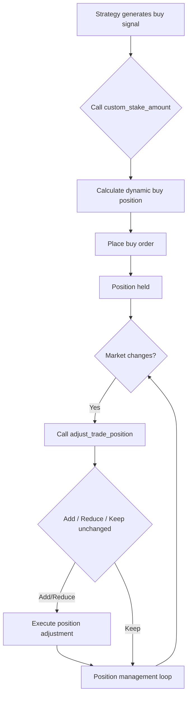

# 📘 Smart Position Control Tools! Freqtrade’s Two Key Functions to Say Goodbye to Rigid Buying
This article is produced by [https://www.itrade.icu](https://www.itrade.icu) Quantitative Trading Lab. Please visit [https://www.itrade.icu](https://www.itrade.icu)  for more benefits.
In quantitative trading, position management is a key factor in controlling risk and improving returns.
Freqtrade provides two powerful and flexible functions to help us intelligently adjust positions:

* **`custom_stake_amount`**: Dynamically calculate the position size for each trade.
* **`adjust_trade_position`**: Automatically increase or decrease positions based on market and current holdings.

This article will explain the functionality and use cases of these two functions, with complete code examples to help you master the core techniques of intelligent position control.

---

## 🔍 1. custom\_stake\_amount: Dynamically Calculate Buy Position

### Function Overview

`custom_stake_amount` allows the strategy to dynamically calculate the amount or coin quantity for the current buy, replacing the fixed `stake_amount` in the configuration file.
You can flexibly adjust the buy size based on market trend, account balance, volatility, and other factors.

---

### Typical Use Cases

| Scenario                           | Description                                              |
| ---------------------------------- | -------------------------------------------------------- |
| Strong market trend                | Increase investment, enlarge position                    |
| Market volatility or unclear trend | Reduce investment, open positions cautiously             |
| Changes in account balance         | Dynamically adjust position according to current balance |

---

### Function Signature Example

```python
def custom_stake_amount(self, pair: str, current_time: datetime, current_rate: float,
                        proposed_stake: float, min_stake: float, max_stake: float, **kwargs) -> float:
    """
    Return the actual amount to invest in this buy.
    """
```

---

### 📘 Example: Dynamically Adjust Stake Based on Account Balance

```python
    def custom_stake_amount(self, pair, current_time, current_rate, proposed_stake, min_stake, max_stake, **kwargs) -> float:
        """
        Dynamically control position size:
        - If account balance > 1000 USDT, invest 20%
        - If account balance < 100 USDT, only allow a small test trade
        - Otherwise, use the system suggested value
        """

        # Get account balance
        balance = self.wallets.get_total(self.config['stake_currency'])

        if balance > 1000:
            stake = min(balance * 0.2, max_stake)  # Max 20% of balance
        elif balance < 100:
            stake = min_stake  # Only minimum allowed
        else:
            stake = proposed_stake  # Use default suggested stake

        print(f"[custom_stake_amount] Current balance: {balance:.2f}, Set stake: {stake:.2f}")
        return stake
```

---

## 🔍 2. adjust\_trade\_position: Intelligent Position Adjustment During Holdings

### Function Overview

`adjust_trade_position` handles position adjustments while holding, including:

* Automatically **adding to positions** based on market changes
* Identifying risk signals to **reduce positions** promptly
* Implementing partial take-profit or stop-loss

---

### Typical Use Cases

| Scenario                       | Adjustment Action | Description                           |
| ------------------------------ | ----------------- | ------------------------------------- |
| Profit exceeds threshold       | Add position      | Capture trend and increase returns    |
| Loss exceeds warning threshold | Reduce position   | Control risk and prevent further loss |
| Sudden market reversal         | Partial exit      | Protect profit and reduce drawdown    |

---

### Function Signature Example

```python
def adjust_trade_position(self, trade: Trade, current_time: datetime, current_rate: float, **kwargs) -> float:
    """
    Return the adjustment amount (positive to add, negative to reduce, 0 to keep unchanged)
    """
```

---

### Example: Adjust Position Based on Profit/Loss Ratio

```python
def adjust_trade_position(self, trade, current_time, current_rate, **kwargs) -> float:
    profit_ratio = (current_rate - trade.open_rate) / trade.open_rate

    if profit_ratio > 0.05:
        # Profit > 5%, add 10%
        add_amount = trade.amount * 0.1
        self.log(f"[adjust_trade_position] {trade.pair} Profit >5%, adding {add_amount} units")
        return add_amount

    if profit_ratio < -0.03:
        # Loss > 3%, reduce 20%
        reduce_amount = -trade.amount * 0.2
        self.log(f"[adjust_trade_position] {trade.pair} Loss >3%, reducing {abs(reduce_amount)} units")
        return reduce_amount

    return 0.0
```

---

## 📈 3. Intelligent Position Control Flow Diagram



---

## 🔔 4. Recommendations and Notes

* **Boundary limits**: Always limit minimum/maximum buy amount to prevent extreme orders.
* **Risk control**: Combine with overall position allocation to avoid overexposure and liquidation risk.
* **Logging**: Record each position adjustment for easier backtesting and tuning.
* **Test coverage**: Backtest across multiple scenarios to ensure robust logic and prevent overfitting.

---

## 5. Summary

`custom_stake_amount` and `adjust_trade_position` are the two key tools in Freqtrade for intelligent position management.

* `custom_stake_amount` dynamically decides the investment amount for opening a position.
* `adjust_trade_position` allows position adjustments during holding.

Using them properly makes your strategy more flexible, aligned with real market conditions, and able to improve profits while controlling risk.
