# Position Adjustment Made Easy! Freqtrade Dynamic Position Management Guide
> This article was produced by the Quantitative Trading Lab at [https://www.itrade.icu](https://www.itrade.icu). Visit for more benefits.
In live trading, dynamically adjusting positions—adding or reducing trades in batches—is essential for maximizing profits and managing risk. Freqtrade supports dynamic position adjustment and multiple entries, enabling advanced operations like scaling in and out. This guide covers key parameters and practical examples.

---

## ⚡ `ignore_roi_if_entry_signal` — Ignore ROI to Prioritize Entry Signals

`ignore_roi_if_entry_signal` determines whether to ignore the `minimal_roi` take-profit rules when an existing position receives a new entry signal. When enabled, the strategy may extend its holding period even if the ROI is reached. Default is `False`.

* **When `True`:**

  * If a new entry signal appears while holding a position, the ROI take-profit is ignored.
  * Even if ROI is achieved, the strategy waits for new signals before selling.
  * Useful for trend-following strategies or staged entries.

* **When `False`:**

  * ROI take-profit is strictly enforced.
  * Even if new entry signals occur, a position is sold when ROI conditions are met.

```python
ignore_roi_if_entry_signal = True
```

#### ⚖️ Priority Logic Diagram

```mermaid
graph TD
  A[Currently Holding] --> B{ROI Achieved?}
  B -->|Yes| C{Exit Signal?}
  C -->|Yes| D{exit_profit_only?}
  D -->|Yes| E{Is Position Profitable?}
  E -->|Yes| F[✅ Close Position]
  E -->|No| G[❌ Hold]
  D -->|No| F
  C -->|No| H{Use ROI Auto Exit?}
  H -->|Yes| F
  H -->|No| G
```



---

## 🔄 `position_adjustment_enable` — Enable Position Adjustment

This parameter activates **custom position adjustment** functionality.

#### Code Example: Adding Positions

```python
position_adjustment_enable = True

def adjust_trade_position(self, trade, current_time, current_rate, current_profit, **kwargs) -> Optional[float]:
    """Add position when profit > 10%"""
    if current_profit > 0.10:
        return 10.0  # Add 10 USDT
    return None
```

#### Code Example: Reducing Positions

```python
def adjust_trade_position(self, trade, current_time, current_rate, current_profit, **kwargs) -> Optional[float]:
    """Reduce position when loss exceeds 3%"""
    if current_profit < -0.03:
        return -trade.stake_amount * 0.5  # Reduce 50%
    return None
```

⚠️ Notes:

* Must be paired with `adjust_trade_position()` function.
* Supports dynamic scaling during active positions.
* Can react to new entry signals for adding/reducing positions.

---

## 📈 `max_entry_position_adjustment` — Maximum Additions per Trade

```python
max_entry_position_adjustment = 3
```

* Limits the maximum number of allowed position adjustments per trade.
* Prevents unlimited scaling and excessive risk.
* Typical range: 1–5, depending on strategy and risk management.

---

## 🛠️ `adjust_trade_position()` Detailed Example

This function defines the actual logic for adjusting positions, based on current size, market signals, or profit/loss.

```python
def adjust_trade_position(self, trade, current_time, current_rate, current_profit, **kwargs) -> float:
    """
    Return value: target position proportion (0~1)
    Example logic:
    - Initial position: 30%
    - Add 20% if conditions met
    - Max position: 100%
    """
    current_position = trade.amount / trade.stake_amount if trade.stake_amount else 0

    if self.should_add_position(trade, current_time):
        new_position = min(current_position + 0.2, 1.0)
        return new_position
    else:
        return current_position
```

⚠️ Notes:

* Called automatically by the strategy.
* Can combine technical indicators, current profit, and market sentiment for adjustments.
* Must return a value between 0 and 1 representing the target position proportion.

---

## ✅ Summary Table

| Parameter                       | Description                          | Recommended / Notes                                |
| ------------------------------- | ------------------------------------ | -------------------------------------------------- |
| `ignore_roi_if_entry_signal`    | Ignore ROI rules to prioritize entry | `True` for multi-entry/adding positions            |
| `position_adjustment_enable`    | Enable dynamic position adjustment   | `True` — requires implementing adjustment function |
| `max_entry_position_adjustment` | Max number of allowed adjustments    | `3` — adjust according to risk management          |
| `adjust_trade_position()`       | Custom position adjustment function  | Must implement and return target proportion        |
