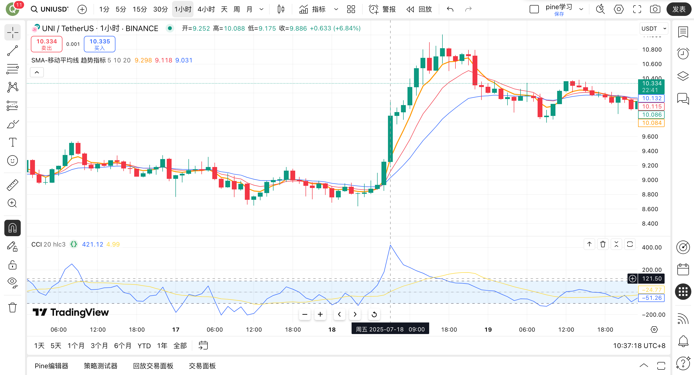

# 📘 CCI Trend Indicator Analysis: Calculation Principles, Trading Signals, and Practical Strategy Guide
This article is produced by [https://www.itrade.icu](https://www.itrade.icu) Quantitative Trading Lab. Please visit [https://www.itrade.icu](https://www.itrade.icu)  for more benefits.

---

## 🧩 Basic Concepts

CCI (Commodity Channel Index) was proposed by Donald Lambert in 1980, originally used for price deviation analysis in commodity markets, and later widely applied to stocks, futures, cryptocurrencies, and other financial markets. It is mainly used to `measure the degree of price deviation from its statistical average`, often used to judge the market's overbought and oversold states and short-term trend reversals.

> **Core Idea: Measure the degree of price deviation from its "normal level".**

When the price deviates far from its average level, the CCI value will become large (positive or negative), used to judge **overbought and oversold states** or **possible reversal timings**.


---

## 🔬 Detailed Explanation of CCI Calculation Principles:

The core idea of CCI is:

> **"The greater the difference between the current price and the mean, the more likely the market is in an overbought or oversold state."**

---

### 📐 Formula Structure (Simplified):

$$
\text{CCI} = \frac{TP - MA(TP)}{0.015 \times MD}
$$

* **TP (Typical Price)**: Typical Price = $(High + Low + Close) / 3$
* **MA(TP)**: n-day Simple Moving Average of TP
* **MD (Mean Deviation)**: Average deviation of TP from its MA(TP)
* **0.015**: Constant factor, standardization coefficient (to make 70% of CCI values fall between -100 and +100)

---

### 🧠 Meaning of Each Part:

| Item                | Description                              |
| ----------------- | ------------------------------- |
| TP (Typical Price) | Used to represent the average price of the period, rather than just the closing price, to more comprehensively reflect the current trend |
| MA(TP)            | Smooths TP to construct the "price center"            |
| MD (Mean Deviation)           | Measures the degree of current price deviation from the center (volatility range)             |
| Standardization Factor 0.015       | Empirical value, used to concentrate most calculation results in \[-100, 100]  |

---

### ✅ Principle Summary:

> **CCI is essentially a standardized deviation indicator that judges the distance of the current price from its mean; the farther, the more extreme, thereby generating trading opportunities.**

* High CCI → Excessive deviation from average price → Overbought → Consider selling
* Low CCI → Excessive deviation from average price (downward) → Oversold → Consider buying

---


## 🧮 Detailed Calculation

### 📐 Indicator Calculation Algorithm

1. **Typical Price TP (Typical Price)**

   $$
   TP = \frac{High + Low + Close}{3}
   $$

2. **Moving Average MA (Usually the n-day mean of TP)**

   $$
   MA = \frac{\sum TP}{n}
   $$

3. **Mean Deviation MD (Mean Deviation)**

   $$
   MD = \frac{1}{n} \sum |TP - MA|
   $$

4. **CCI Formula**

   $$
   CCI = \frac{TP - MA}{0.015 \times MD}
   $$

> The coefficient **0.015** is an empirical value, ensuring most CCI values fall between -100 and +100.

---


## 🧪 Calculation Case Simulation: 5-Day Period CCI (Trend Indicator)

### 📌 Review of the Formula:

**CCI (Commodity Channel Index) calculation formula is as follows:**

$$
CCI = \frac{TP - MA(TP)}{0.015 \times MD}
$$

Where:

* **TP (Typical Price)** = (High + Low + Close) / 3
* **MA(TP)**: Moving average of TP over n days (usually simple average)
* **MD (Mean Deviation)** = Average of the absolute deviations of each TP from MA(TP) over n days
* **0.015**: Constant, used to standardize CCI values

---

### 📊 Raw Data (D1-D5)

| Date | High | Low | Close | TP                      |
| -- | ---- | --- | ----- | ----------------------- |
| D1 | 110  | 100 | 105   | (110+100+105)/3 = 105.0 |
| D2 | 112  | 101 | 108   | (112+101+108)/3 = 107.0 |
| D3 | 115  | 105 | 110   | (115+105+110)/3 = 110.0 |
| D4 | 117  | 107 | 112   | (117+107+112)/3 = 112.0 |
| D5 | 120  | 110 | 115   | (120+110+115)/3 = 115.0 |

---

### ✅ Step 1: Calculate TP (Typical Price)

As calculated in the table above, the TP for the 5 days is:

```
TP Sequence = [105.0, 107.0, 110.0, 112.0, 115.0]
```

---

### ✅ Step 2: Calculate the 5-Day Simple Moving Average MA(TP) of TP

$$
MA(TP) = \frac{105.0 + 107.0 + 110.0 + 112.0 + 115.0}{5} = \frac{549.0}{5} = 109.8
$$

---

### ✅ Step 3: Calculate Mean Deviation (MD)

Calculate the absolute deviation of each TP from MA(TP), then take the average:

| Date | TP    | Deviation from MA(TP)         | Absolute Value |
| -- | ----- | -------------------- | --- |
| D1 | 105.0 | 105.0 - 109.8 = -4.8 | 4.8 |
| D2 | 107.0 | -2.8                 | 2.8 |
| D3 | 110.0 | +0.2                 | 0.2 |
| D4 | 112.0 | +2.2                 | 2.2 |
| D5 | 115.0 | +5.2                 | 5.2 |

$$
MD = \frac{4.8 + 2.8 + 0.2 + 2.2 + 5.2}{5} = \frac{15.2}{5} = 3.04
$$


---

### ✅ Step 4: Calculate CCI Value (Only Available from Day 5)

$$
CCI = \frac{TP_{D5} - MA(TP)}{0.015 \times MD} = \frac{115.0 - 109.8}{0.015 \times 3.04}
$$

$$
= \frac{5.2}{0.0456} ≈ 114.04
$$

---

### ✅ Final Results Summary:

| Date | TP    | MA(TP) | MD   | CCI     |
| -- | ----- | ------ | ---- | ------- |
| D1 | 105.0 | -      | -    | -       |
| D2 | 107.0 | -      | -    | -       |
| D3 | 110.0 | -      | -    | -       |
| D4 | 112.0 | -      | -    | -       |
| D5 | 115.0 | 109.8  | 3.04 | ≈114.04 |

---


## 💡 Detailed Explanation of Trading Signals: How to Use CCI to Judge Buy and Sell Points?

CCI (Commodity Channel Index, Trend Indicator) is mainly used to identify the degree of price deviation from its "normal level", helping traders discover **overbought/oversold, trend turning points** or **divergence signals**.

### 📈 CCI Value Interpretation and Operation Suggestions

| **CCI Value Range** | **Market State** | **Signal Interpretation**                       | **Operation Suggestions**                  |
| ------------ | -------- | ------------------------------ | ------------------------- |
| > **+100**   | Overbought Zone      | Price is far above the mean, possibly rising too fast, with short-term pullback risk        | Be cautious about chasing highs, consider reducing positions at highs or shorting short-term          |
| < **-100**   | Oversold Zone      | Price is far below the mean, short-term decline excessive, possible rebound opportunity         | Pay attention to reversal signals, consider light position bottom-fishing or rebound grabbing         |
| -100 \~ +100 | Normal Zone      | Price fluctuations are near the average level, market may oscillate or lack direction       | Suggest observing, wait for CCI to break the range boundaries or combine with trend judgment |
| **CCI Crosses Above 0** | Trend Emerging     | Crossing 0 from negative, indicating price starting to be stronger than average, possibly entering uptrend | Can serve as initial long entry signal, further confirm with moving averages, volume  |
| **CCI Crosses Below 0** | Trend Weakening     | Falling below 0 from positive, indicating weakening price, trend may end or adjust     | Can serve as short signal or profit-taking prompt, note coordination with support levels   |

---

### 🧠 Practical Suggestions and Strategy Coordination

1. **Multi-Timeframe Linkage Judgment**

   * Daily CCI breaks +100, 4H CCI high dead cross: **High reversal signal**
   * Daily CCI crosses below 0, 15min CCI falls into -100: **Short confirmation signal**

2. **Combine with Trend Indicators (e.g., EMA, MACD)**

   * EMA uptrend + CCI crosses above 0: **Trend-following long signal**
   * EMA dead cross + CCI crosses below -100: **Trend-following short signal**

3. **Overbought Oversold and Reversal Timing**

   * CCI running long-term in extreme zones (±200), reversal signals more reliable.
   * After extreme values, **observe if divergence, price stagnation** occurs, then consider reversal operations.

---

### ⚠️ Notes

* CCI **is not suitable for standalone use**, prone to false signals in oscillating markets.
* In **trending markets, better effect when combined with other trend confirmation tools**.
* **Value ranges can be adjusted based on periods**: e.g., short-term strategies may use ±150 as reference thresholds.
---


---


## ⚖️ Detailed Analysis of Indicator Advantages and Disadvantages: Is CCI Worth Using?

CCI (Trend Indicator) is widely used for trend identification and overbought oversold judgments, due to its `sensitivity to price deviations from the mean` and is heavily used in short-term and oscillating strategies. However, it is not omnipotent; understanding its pros and cons helps better design strategies and avoid risks.

---

### ✅ Advantages Analysis

| Advantages                  | Description                                                                   |
| ------------------- | -------------------------------------------------------------------- |
| **Sensitive to Short-Term Price Fluctuations, Quick Response**  | Compared to RSI, MACD, etc., CCI is more sensitive to price fluctuation changes, **suitable for short-term strategies**, such as 15min~1H periods, identifying turning points earlier. |
| **Combines Trend Judgment and Overbought Oversold Prompt Functions** | When CCI is above +100 or below -100, it can help identify extreme markets; crossing near 0 can serve as **signal line for trend changes**, relatively comprehensive functions.    |
| **Suitable for Oscillating Market Trading and Pullback Low-Buy Strategies**  | CCI is particularly suitable for **markets where prices fluctuate around the mean**, capturing "reversion" opportunities after price deviations from the moving average, a common tool for oversold rebound strategies.           |
| **Simple Calculation, Strong Adaptability**       | Principle based on deviation values of TP and its moving average, **can be used for various targets (coins, stocks, futures)**, and flexibly embedded in various quantitative strategy frameworks.             |

---

### ❌ Disadvantages Analysis

| Disadvantages                | Description                                                                       |
| ----------------- | ------------------------------------------------------------------------ |
| **Frequent False Signals, Easy to Mislead Operations**  | In strong trending markets, CCI often issues "overbought/oversold" warnings prematurely, causing traders to make reverse decisions too early. For example, prompting "overbought" during uptrends, easy to miss main rising segments.         |
| **Overly Dependent on Parameter Settings, Poor Robustness** | Different varieties, different periods respond differently to `n` parameters (e.g., CCI(20), CCI(14)), **cannot "one size fits all" all market environments**, need parameter tuning tests. |
| **Not Recommended for Standalone Use as Trend Tracking Tool** | CCI performs adequately in oscillating markets, but prone to failure in one-sided markets, **need to combine with trend indicators (e.g., MA, MACD)**, otherwise low signal credibility.         |
| **Extreme Values Without Absolute Reference Standards**    | Although +100/-100 are common thresholds, different targets may have large volatility differences, **thresholds need dynamic adjustment**, otherwise easy to misjudge true strength states.              |

---

### 🧠 Practical Suggestions

* **Suitable for Oscillation-Based, Short-Term Deviation Traders**, such as range arbitrage, Bollinger Band strategies, etc., can pair with CCI;
* **Trend Traders Use with Caution**: Suggest only as trend turning point observation indicator, not as core entry condition;
* **Best with Multi-Indicator Combination**: With EMA, Bollinger Bands, KDJ, volume indicators, can effectively filter some false signals;
* **Can Be Used as Backtest Strategy Filter**: e.g., only enter long when CCI above 0, as trend filter.


---

## ⚠️ Detailed Explanation of Signal Traps and Counter Strategies: Avoid Being "Tricked In and Out" by CCI

Although CCI can provide prompts for trend changes and extreme states, it is not 100% reliable, especially in strong trends and oscillating markets, **prone to false signals and misleading triggers**. Below are three typical traps and practical counter methods:

---

### 🔻 Trap One: Premature Trend Reversal, CCI Runs Ahead

* **Example Phenomenon:** In a strong uptrend, CCI falls back from high levels (e.g., +200) and breaks below +100, prematurely prompting "overbought end" or "short signal";
* **Root Cause:** CCI calculation based on "deviation of current price from mean", may quickly fall back during brief price pullbacks, leading to incorrect trend reversal judgments;
* **Consequences:** Premature shorting, instead missing the trend up or stopping loss;
* **Counter Strategies:**

  * **Add Trend Filter Conditions:** Introduce moving average systems (e.g., MA20 crosses above MA60) or MACD golden cross, etc., for trend confirmation;
  * **Set CCI Pullback Thresholds:** Not directly short when breaking +100, wait for breaking 0 to confirm signal;
  * **Overlay Price Structure Judgment:** If price still in rising channel, ignore CCI downside.

---

### 🧨 Trap Two: Failed Bottom-Fishing, CCI Does Not Reverse

* **Example Phenomenon:** CCI breaks below -100, considered "severely oversold", enter long, but price continues to fall;
* **Root Cause:** Oversold ≠ Rebound, low CCI only represents deviation from mean, does not mean reversal is imminent;
* **Consequences:** Bottom-fishing gets trapped, rebound delayed;
* **Counter Strategies:**

  * **Combine RSI or KDJ for Oversold Confirmation:** Only when CCI and RSI/KDJ are simultaneously in extremely low ranges, and reversal signals appear, then consider long;
  * **Wait for CCI to Cross Above -100 or 0 Before Entering:** More conservative entry method;
  * **Add Volume Confirmation:** If declining with increasing volume, bottom-fishing should be cautious.

---

### ⚙️ Trap Three: Sideways Oscillation, Frequent CCI Noise

* **Example Phenomenon:** During market sideways oscillation, CCI repeatedly crosses around ±100, frequently issuing "overbought/oversold" signals;
* **Root Cause:** In oscillating markets, small price deviations from mean can be amplified into signals, misleading traders into frequent operations;
* **Consequences:** Multiple invalid entries and exits, accumulated slippage and commission losses;
* **Counter Strategies:**

  * **Use Bollinger Bands or ADX to Discern Market Nature:** If Bollinger Bands contract + ADX < 20, it's oscillating market, can pause CCI signals;
  * **Set Trigger Range Widths:** e.g., set thresholds to ±150 (instead of ±100), reduce sensitivity;
  * **Use CCI Only After Breakouts to Follow Trends:** i.e., trend-following, not bottom/top-picking.

---

### 🧠 Practical Summary Suggestions:

| Trap Type   | Suggested Counter Solutions                      |
| ------ | --------------------------- |
| Premature Trend Reversal | Introduce trend auxiliary filters, e.g., MA upward and price new highs before considering reversal |
| Failed Bottom-Fishing   | Combine RSI/KDJ, multi-indicator resonance before deciding        |
| Sideways Noise   | Add oscillating market identification mechanisms, limit signal triggers in narrow ranges     |

---


## 🔍 Divergence: What If It's Not That Obvious?

In quantitative and technical analysis, **CCI Divergence** is an important means to judge potential trend reversals. However, real market conditions are often not as "standard" as in textbooks; most of the time, divergence signals **are not obvious**, and can even be masked by "noise" due to fluctuations and oscillations.

---

### ✅ What is CCI Divergence?

**Divergence** refers to inconsistencies in direction between price trends and momentum indicators (like CCI), for example:

* **Top Divergence (Bearish)**: Price makes new high, but CCI fails to make new high;
* **Bottom Divergence (Bullish)**: Price makes new low, but CCI does not synchronously make new low.

This indicates that although price is rising/falling, the underlying momentum is weakening, possibly signaling an impending market reversal.

---

### ⚠️ Common Problems and Issues

1. **No Obvious High/Low Point Correspondence**
   → For example, price slightly makes new high, while CCI top is very close or slightly lower, unable to confirm if it constitutes divergence.

2. **Divergence Period Too Short, Prone to Misjudgment**
   → In small wave segments, CCI may frequently mismatch price peaks and valleys, causing "false divergence".

3. **"Pseudo Divergence" in Oscillating Markets**
   → Bullish or bearish energy is inherently weak, divergence signals do not represent effective reversals.

---

### 🛠 Counter Strategies and Optimization Suggestions

#### 1️⃣ Relax the "Strictness" of Divergence: Not Necessarily "Highest/Lowest"

* **Traditional Problem:** Only recognize divergence at "extreme high/low" points of price and CCI, easy to miss real signals.
* **Practical Optimization:** Can use "relative high/low points" judgment—i.e., as long as price uptrend is obvious, and CCI top no longer makes new high, can be seen as "potential divergence".
* **Auxiliary Indicator:** Use ZigZag to filter noise peaks and valleys, extract clearer high-low point structures.

#### 2️⃣ Combine Other Momentum Indicators: Multi-Divergence Resonance Enhances Confirmation

* **Combination Suggestions:**

  * **RSI Divergence**: RSI fails to make high/low, synchronous divergence with CCI more effective;
  * **MACD Divergence**: Histogram or DIFF forms divergence with price, implying trend strength exhaustion;
  * **Stochastic Divergence**: Observe KD divergence with price in extreme zones, can also serve as reference.

* **Practical Technique:** Two or more indicators showing divergence before considering position building, improve success rate.

#### 3️⃣ Add "Confirmation Mechanisms": Does It Really Weaken After Divergence?

* **Core Idea:** Divergence itself does not mean immediate reversal, key is whether "confirmation signals" appear afterward.

* **Example Conditions:**

  * After CCI divergence, **CCI continuously declines** (e.g., 2-3 consecutive closing prices lower);
  * **RSI breaks key support level** (e.g., 50);
  * **MACD Dead Cross** or Histogram Reversal;
  * **Price effectively breaks trend line or previous low**.

* **Strategy Example:**

  ```text
  IF (Price New High AND CCI Not New High) THEN
    IF (CCI Continuously Declines AND RSI < 50)
      THEN Short Signal Established
  ```

#### 4️⃣ Avoid Overusing Divergence in Low Timeframe Charts

* **Problem:** 1-minute, 5-minute, etc., small periods have large fluctuations, much noise, frequent and distorted divergence;
* **Suggestions:**

  * Only judge divergence on **15-minute or above periods**;
  * Small periods only for auxiliary entry/exit, not for trend judgment.

---

### 📌 Summary: 4 Methods to Improve Divergence Signal Quality

| Method                      | Role                |
| ----------------------- | ----------------- |
| Relax High-Low Point Restrictions                 | Increase identification probability, don't miss effective divergence    |
| Combine RSI / MACD etc. Indicators       | Multi-confirmation, reduce false signals        |
| Add CCI Decline / RSI Break etc. Confirmation Conditions | Whether really weakens after divergence, increase reversal success rate |
| Use Medium-High Periods to Observe Divergence              | Reduce noise interference, improve signal effectiveness    |

---


## 🧠 Advanced Usage Techniques

### 1. Trend Coordination Method: Combine Trend Indicators to Confirm Signals, Improve Trading Success Rate

Using CCI alone is prone to false signals; combining with trend indicators can more accurately judge buy and sell timings:

* **Combine with EMA (Exponential Moving Average)**
  For example: Only when CCI issues oversold signal (< -100) and price is above EMA 20, consider long; conversely, CCI overbought (> +100) and price below EMA 20, consider short.

  * Advantages: Avoid counter-trend trading, follow main trend, reduce loss probability.
  * In practice, can set multiple EMAs (e.g., EMA 5, EMA 20) for multi-layer trend filtering.

* **Combine with Bollinger Bands**
  Use Bollinger Bands to judge if price is in extreme ranges:

  * When CCI < -100 and price touches Bollinger lower band, possible short-term rebound opportunity.
  * When CCI > +100 and price touches Bollinger upper band, short-term pullback may occur anytime.
  * This helps identify price extreme points, suitable for reversal trading.

---

### 2. Multi-Timeframe Linkage: Cross-Timeframe Confirmation of Signals, Enhance Signal Reliability

Use CCI from different time periods to coordinate and judge market rhythm, filter noise, find best entry points:

* **Daily + 4-Hour Linkage Example**

  * Daily CCI in oversold zone (< -100), indicating overall trend weak but possible rebound.
  * 4-Hour CCI just crosses 0 upward from negative, implying short-term momentum starting to strengthen.
  * Dual-period confirmation makes buy signal more reliable, suitable for medium-short term long positions.

* **Other Combinations**

  * 1-Hour confirms trend direction, 15-Minute confirms specific entry timing.
  * Multiple periods CCI synchronously showing divergence or overbought oversold, improve trading accuracy.

---

### 3. Reversal Breakout Strategy: Capture Strong Momentum Short-Term Trend Starting Points

* When **CCI breaks +100 and continuously makes new highs**, indicates strong short-term buying, possible rapid rise.
* At this time, consider following trend long, especially short-term chasing in high volatility environments.
* Combine with volume and other momentum indicators (e.g., MACD histogram enlargement) to confirm strength.
* Note risk control, set reasonable take-profit stop-loss, prevent "false breakouts".

---

### 4. Combine Volume and Volatility Indicators to Assist in Confirming CCI Signals

* **Volume Indicators (e.g., Volume MA, OBV)**: When CCI issues buy/sell signals, if accompanied by volume increase, signal more convincing.
* **Volatility Indicators (e.g., ATR)**: Judge if market in active volatility period, signals more effective in high volatility, low volatility may fall into oscillation.

---

### 5. Multi-Indicator Signal Fusion, Build Comprehensive Trading Strategies

* Combine RSI, MACD, ADX, etc., for multi-indicator resonance trading.
* For example: CCI overbought and RSI also reaches overbought zone, while MACD dead cross, as short confirmation signal.
* Multi-signal confirmation reduces risks from single indicator misjudgments.

---

### 6. Adopt Dynamic Thresholds and Adaptive Parameters

* CCI overbought oversold thresholds can be dynamically adjusted based on market volatility, e.g., use volatility indicators to adjust +100/-100 boundaries.
* Use moving windows to calculate parameters, improve indicator adaptability to different market environments.


---

## 🔧 Case Practical (Freqtrade Strategy Example)
This `CCIRSITrendStrategy` strategy combines two classic indicators—CCI and RSI, mainly used for short-medium term trend trading on 1-hour K-line periods.

* **Buy Signal**: When CCI indicator below -100 (oversold zone), and RSI below 35, indicating short-term market oversold, potential rebound signal, strategy triggers long entry.
* **Sell Signal**: When CCI above +100 (overbought zone), or RSI above 70, indicating market overbought, strategy triggers exit or short.
* Strategy sets **3% stop-loss** and **phased gradual take-profit (ROI)**, achieving risk control and profit management.
* This strategy suitable for oscillating and trend-alternating market environments, simple and easy for live tracking.

```python
import talib.abstract as ta
from freqtrade.strategy.interface import IStrategy
from pandas import DataFrame

class CCITrendStrategy(IStrategy):
    # Minimal ROI: 10% after 60 minutes
    minimal_roi = {
        "60": 0.10,
        "30": 0.05,
        "0": 0
    }

    # Stoploss at 3%
    stoploss = -0.03

    timeframe = '1h'  # 1-hour period
    process_only_new_candles = True

    def populate_indicators(self, dataframe: DataFrame, metadata: dict) -> DataFrame:
        dataframe['cci'] = ta.CCI(dataframe, timeperiod=20)
        return dataframe

    def populate_entry_trend(self, dataframe: DataFrame, metadata: dict) -> DataFrame:
        dataframe.loc[
            (dataframe['cci'] < -100),
            'enter_long'] = 1
        return dataframe

    def populate_exit_trend(self, dataframe: DataFrame, metadata: dict) -> DataFrame:
        dataframe.loc[
            (dataframe['cci'] > 100),
            'exit_long'] = 1
        return dataframe

```
### 📊 Strategy Backtest Results: `CCITrendStrategy`


> ⏱ Backtest Time Range: 2024-06-01 ~ 2024-10-01  
> 📈 Maximum Concurrent Positions: 1

| Strategy         | Trades | Avg Profit % | Tot Profit (USDT) | Tot Profit % | Avg Duration | Win / Draw / Loss | Win Rate | Max Drawdown          |
|------------------|--------|--------------|-------------------|--------------|---------------|--------------------|----------|------------------------|
| CCITrendStrategy | 127    | -0.50%       | -189.879 USDT     | -18.99%      | 10:00:00      | 35 / 47 / 45        | 27.6%    | 198.31 USDT / 19.67%   |

📌 **Analysis Summary**:
- Strategy executed a total of 127 trades, average loss per trade -0.5%
- Total loss reached -189.88 USDT, overall return for backtest period -18.99%
- Win rate 27.6%, still insufficient to cover losses
- Maximum drawdown close to 20%, strategy risk resistance weak

> It can be seen that using `CCI` indicator alone for profitability is still not strong. It is recommended to use multi-indicator configurations!

---

## 🧾 Indicator Summary + Practical Suggestions

* CCI is an auxiliary indicator suitable for short-term reversals and oscillating markets, able to better capture overbought oversold signals.
* Not recommended to use CCI alone, best effect is combined with trend indicators (e.g., EMA) or momentum indicators (e.g., RSI) to improve signal accuracy.

### Practical Strategy Suggestions:

* When CCI < -100 and RSI < 35, consider long entry, capture oversold rebound opportunities.
* When CCI > +100 and RSI > 65, consider short or exit long, avoid chasing highs.

### Practical Test Period Suggestions:

* CCI time periods commonly 20 or 14, suitable for 1-hour to 4-hour level K-line periods.
* Parameters can be fine-tuned according to different coins and market fluctuations for more precise trading rhythm.