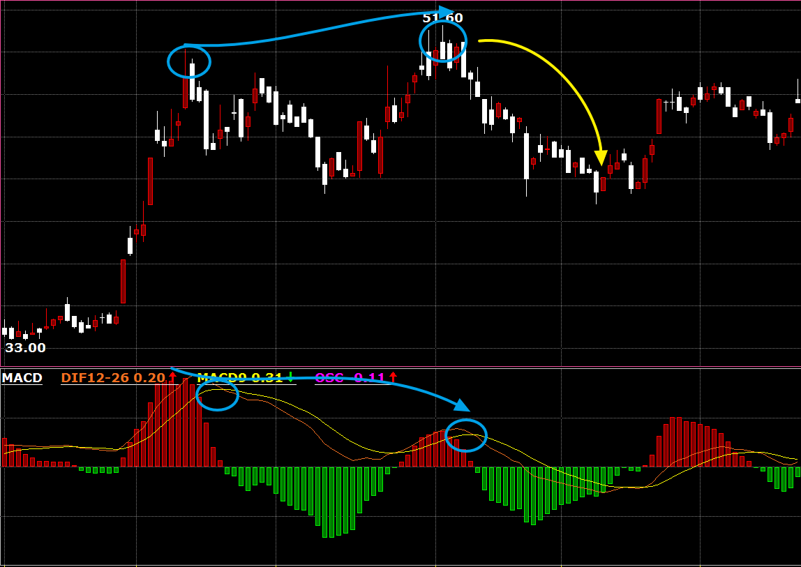

# 📘 Comprehensive Analysis of MACD Indicator: From Calculation Logic to Practical Strategies

> is article was produced by the Quantitative Trading Lab at [https://www.itrade.icu](https://www.itrade.icu). Visit for more benefits.


## 🧠 Basic Concepts + Principles

**MACD (Moving Average Convergence Divergence)** is a trend-following momentum indicator proposed by **Gerald Appel**.

Core Idea:

* Observe the "divergence" and "convergence" between short-term and long-term moving averages.
* Judge trend strength, reversal timing, and buy/sell signals.

**MACD consists of three parts:**

1. **DIF Line**: Short-term EMA - Long-term EMA (e.g., EMA(12) - EMA(26))
2. **DEA Line** (also known as Signal): 9-day EMA smoothing line of DIF
3. **MACD Histogram**: DIF - DEA, reflecting changes in bullish and bearish forces

## 

Of course, below is a more detailed **MACD Indicator Calculation Algorithm Analysis**, suitable for inclusion in technical tutorials or quantitative strategy documents:

***

## 🧮 Detailed Calculation

### 📌 Indicator Calculation Algorithm (Using Default Parameters 12, 26, 9 as Example)

MACD (Moving Average Convergence Divergence) indicator reflects the trend strength and reversal signals of prices through the difference between two exponential moving averages (EMA).

***

### Step One: Calculate EMA12 and EMA26

* **EMA12** represents the exponential moving average of the recent 12 prices (usually closing prices), with faster response.
* **EMA26** is the exponential moving average of the recent 26 prices, with slower response.

The core formula for exponential moving average is:

$$
\text{EMA}_t = \text{Price}_t \times \alpha + \text{EMA}_{t-1} \times (1 - \alpha)
$$

Where the smoothing coefficient $\alpha = \frac{2}{n+1}$, n is the period.

* For EMA12, $\alpha = \frac{2}{13} ≈ 0.1538$
* For EMA26, $\alpha = \frac{2}{27} ≈ 0.0741$

***

### Step Two: Calculate DIF Value (also known as MACD Fast Line)

$$
\text{DIF}_t = \text{EMA}_{12,t} - \text{EMA}_{26,t}
$$

DIF reflects the difference between short-term and long-term trends, representing changes in price momentum.

***

### Step Three: Calculate DEA Value (also known as Signal Line or MACD Slow Line)

DEA is the 9-day EMA of DIF:

$$
\text{DEA}_t = \text{EMA}_{9}(\text{DIF})
$$

* Smoothing coefficient: $\alpha = \frac{2}{10} = 0.2$
* Meaning: Used to smooth the DIF curve and confirm the trend

***

### Step Four: Calculate MACD Histogram (Histogram)

The MACD histogram (also called Histogram) is used to visualize the gap between DIF and DEA:

$$
\text{MACD}_t = 2 \times (\text{DIF}_t - \text{DEA}_t)
$$

Multiplied by 2 because the original indicator designer Gerald Appel wanted to amplify the visual effect.

***

We now use a set of simplified closing prices to **manually calculate the three MACD elements (DIF, DEA, MACD Histogram) step by step**.\
Suitable for understanding the essence of the formula, and also suitable for inclusion in teaching documents or paid courses.

***

Good, I'll help you make the content more complete and accurate while keeping it clear and easy to understand. Below is the rewritten version, including formulas, detailed calculations, notes, and table display:

***

## 🔢 Simulation Example Data (Closing Prices):

```
[10, 10.2, 10.5, 10.4, 10.7, 10.9, 11.2, 11.5, 11.3, 11.6]
```

Using MACD parameters **(12, 26, 9)**.

For simplicity, **initialize EMA12 and EMA26 using the simple moving average (SMA) of the first 6 closing prices**, and start calculating from the 7th data point.

***

### 📐 Smoothing Coefficient (α) Calculation Formula

MACD uses exponential moving averages (EMA), with different periods corresponding to different smoothing coefficients α, calculated as:

$$
\alpha = \frac{2}{N + 1}
$$

*   **Smoothing coefficient for EMA12**:

    $$
    \alpha_{EMA12} = \frac{2}{12 + 1} = \frac{2}{13} ≈ 0.1538
    $$
*   **Smoothing coefficient for EMA26**:

    $$
    \alpha_{EMA26} = \frac{2}{26 + 1} = \frac{2}{27} ≈ 0.0741
    $$
*   **Smoothing coefficient for DEA (EMA on DIF)**:

    $$
    \alpha_{DEA} = \frac{2}{9 + 1} = \frac{2}{10} = 0.2
    $$

***

## 🧮 Step 1: Initialize EMA12 and EMA26

Use the first 6 closing prices to calculate the simple average as the initial EMA:

$$
EMA12_{init} = EMA26_{init} = \frac{10 + 10.2 + 10.5 + 10.4 + 10.7 + 10.9}{6} = 10.45
$$

***

## 📈 Step 2: Start Recursive Calculation from Day 7

EMA recursive formula:

$$
EMA_{today} = P_{today} \times \alpha + EMA_{yesterday} \times (1 - \alpha)
$$

Where:

* $P\_{today}$: Today's closing price
* $\alpha$: Corresponding EMA smoothing coefficient

***

### Day 7 Closing Price = 11.2

**1. Calculate EMA12**

$$
EMA12_7 = 11.2 \times 0.1538 + 10.45 \times (1 - 0.1538) = 1.723 + 8.841 = 10.564
$$

**2. Calculate EMA26**

$$
EMA26_7 = 11.2 \times 0.0741 + 10.45 \times (1 - 0.0741) = 0.830 + 9.673 = 10.503
$$

**3. Calculate DIF**

$$
DIF_7 = EMA12_7 - EMA26_7 = 10.564 - 10.503 = 0.061
$$

**4. DEA Initialization**

For the first DEA, set it to the DIF value of the day (simplified processing):

$$
DEA_7 = DIF_7 = 0.061
$$

**5. Calculate MACD Histogram**

$$
MACD柱_7 = 2 \times (DIF_7 - DEA_7) = 2 \times (0.061 - 0.061) = 0
$$

***

### Day 8 Closing Price = 11.5

**1. EMA12**

$$
EMA12_8 = 11.5 \times 0.1538 + 10.564 \times (1 - 0.1538) = 1.769 + 8.945 = 10.714
$$

**2. EMA26**

$$
EMA26_8 = 11.5 \times 0.0741 + 10.503 \times (1 - 0.0741) = 0.852 + 9.723 = 10.575
$$

**3. DIF**

$$
DIF_8 = 10.714 - 10.575 = 0.139
$$

**4. DEA Recursive**

$$
DEA_8 = DEA_7 \times (1 - 0.2) + DIF_8 \times 0.2 = 0.061 \times 0.8 + 0.139 \times 0.2 = 0.049 + 0.028 = 0.077
$$

**5. MACD Histogram**

$$
MACD柱_8 = 2 \times (DIF_8 - DEA_8) = 2 \times (0.139 - 0.077) = 0.124
$$

***

### Day 9 Closing Price = 11.3

**1. EMA12**

$$
EMA12_9 = 11.3 \times 0.1538 + 10.714 \times 0.8462 = 1.738 + 9.065 = 10.803
$$

**2. EMA26**

$$
EMA26_9 = 11.3 \times 0.0741 + 10.575 \times 0.9259 = 0.837 + 9.790 = 10.627
$$

**3. DIF**

$$
DIF_9 = 10.803 - 10.627 = 0.176
$$

**4. DEA**

$$
DEA_9 = DEA_8 \times 0.8 + DIF_9 \times 0.2 = 0.077 \times 0.8 + 0.176 \times 0.2 = 0.062 + 0.035 = 0.097
$$

**5. MACD Histogram**

$$
MACD柱_9 = 2 \times (0.176 - 0.097) = 0.158
$$

***

### Day 10 Closing Price = 11.6

**1. EMA12**

$$
EMA12_{10} = 11.6 \times 0.1538 + 10.803 \times 0.8462 = 1.785 + 9.142 = 10.927
$$

**2. EMA26**

$$
EMA26_{10} = 11.6 \times 0.0741 + 10.627 \times 0.9259 = 0.860 + 9.837 = 10.697
$$

**3. DIF**

$$
DIF_{10} = 10.927 - 10.697 = 0.230
$$

**4. DEA**

$$
DEA_{10} = DEA_9 \times 0.8 + DIF_{10} \times 0.2 = 0.097 \times 0.8 + 0.230 \times 0.2 = 0.078 + 0.046 = 0.124
$$

**5. MACD Histogram**

$$
MACD柱_{10} = 2 \times (0.230 - 0.124) = 0.212
$$

***

## ✅ Calculation Results Summary Table

| Date   | EMA12  | EMA26  | DIF   | DEA   | MACD Histogram |
| ------ | ------ | ------ | ----- | ----- | -------------- |
| Day 7  | 10.564 | 10.503 | 0.061 | 0.061 | 0.000          |
| Day 8  | 10.714 | 10.575 | 0.139 | 0.077 | 0.124          |
| Day 9  | 10.803 | 10.627 | 0.176 | 0.097 | 0.158          |
| Day 10 | 10.927 | 10.697 | 0.230 | 0.124 | 0.212          |

***

## 🧠 Explanation and Supplements

* **DEA Initialization**: Usually, the first day uses DIF as the DEA initialization value for simplified calculation; actual software may differ slightly.
* **MACD Histogram**: Some systems display as `DIF - DEA`; here multiplied by 2 to amplify the signal for better visualization.
* **EMA Smoothing Coefficient**: Larger α makes EMA more responsive to the latest prices; EMA12 is more sensitive than EMA26.
* **Indicator Meaning**:
  * Larger DIF indicates short-term trend stronger than long-term trend.
  * DEA is the smoothed confirmation line of DIF, used to filter signal noise.
  * MACD Histogram reflects changes in bullish and bearish forces; larger bars indicate trend acceleration, smaller bars indicate trend weakening.

***

## 🔁 Detailed Explanation of Trading Signals

| Signal Type               | Condition                                      | Meaning Explanation                                                         | Trading Suggestions                                                                      |
| ------------------------- | ---------------------------------------------- | --------------------------------------------------------------------------- | ---------------------------------------------------------------------------------------- |
| **Golden Cross (Long)**   | DIF crosses above DEA                          | Bullish trend starts, short-term momentum exceeds long-term momentum        | Consider buying or adding positions, bullish entry signal                                |
| **Dead Cross (Short)**    | DIF crosses below DEA                          | Bearish trend starts, short-term momentum weakens                           | Consider selling or shorting, risk control or exit                                       |
| **Histogram Turns Red**   | MACD Histogram turns from negative to positive | Bullish momentum strengthens, buyers start to dominate                      | Trend reverses upward, suitable for following long                                       |
| **Histogram Turns Green** | MACD Histogram turns from positive to negative | Bearish momentum strengthens, sellers dominate                              | Trend reverses downward, suggest reducing or selling                                     |
| **Zero Axis Crossover**   | DIF or DEA crosses above / below 0 axis        | Key point for bullish/bearish trend switch, confirms trend direction change | Combine with other indicators to confirm trend, can serve as entry/exit auxiliary signal |

***

### Explanation

* **Golden Cross and Dead Cross** are the core buy/sell signals of MACD, representing the crossover of short-term and long-term trends.
* **Histogram Turns Red/Green** is the manifestation of momentum, can capture timing of trend acceleration or weakening.
* **Zero Axis Crossover** sometimes used to confirm trend strength and direction, especially in oscillating markets with reference value.
* In actual trading, suggest combining volume, price patterns, and other technical indicators for multiple confirmations to avoid false signals.

***

If needed, I can help you write "Practical Strategy Examples" or "MACD Advanced Usage" sections. Do you need it?

***

## ⚖️ Indicator Advantages and Disadvantages

### ✅ Advantages:

* **Smooths Price Fluctuations**: Uses exponential moving averages (EMA) to smooth prices, effectively reducing noise and false signals.
* **Strong Trend Identification**: Can intuitively reflect market trend strength and direction, helping traders grasp buy/sell timings.
* **Applicable to Multiple Periods**: MACD applies to various time periods and multiple asset classes, with high flexibility.
* **Combines Momentum Analysis**: Histogram reflects changes in bullish/bearish momentum, helping judge trend acceleration or weakening.

### ❌ Disadvantages:

* **Strong Lag**: As a derivative of moving averages, MACD has certain delay in price changes, with late signal generation.
* **Poor Performance in Oscillating Markets**: In sideways or oscillating conditions, frequent golden and dead crosses, easily leading to frequent trading and losses.
* **Fixed Parameters Limit**: Commonly used (12, 26, 9) parameters may not apply to all markets, need adjustment based on variety and period for better performance.
* **Low Sensitivity to Extreme Conditions**: Slow response to sudden sharp fluctuations, possibly missing optimal trading timings.

***

In practical application, suggest combining MACD with other trend, momentum, or volume indicators to enhance signal accuracy and reliability.

***

## ⚠️ Signal Traps and Counter Strategies

| Trap Type                           | Description                                                                                                                     | Counter Suggestions                                                                                                                                            |
| ----------------------------------- | ------------------------------------------------------------------------------------------------------------------------------- | -------------------------------------------------------------------------------------------------------------------------------------------------------------- |
| False Golden Cross                  | After MACD golden cross signal, price does not continue rising, instead quickly pulls back, leading to misjudging bullish trend | Combine with volume increase to confirm buying force, use trend lines or longer-term moving averages to assist in judging trend direction, avoid chasing highs |
| Dead Cross Rises Instead of Falling | After MACD dead cross signal, price does not fall but rebounds, making bearish signal invalid                                   | Wait for price to break key support levels or confirm downtrend, avoid blindly shorting prematurely                                                            |
| Histogram Oscillation               | MACD histogram fluctuates continuously near zero axis, red/green bars alternate frequently, signals noisy, direction unclear    | Pair with momentum indicators like RSI, ADX to filter oscillating conditions, avoid frequent trading, choose periods with obvious trends                       |
| Lagging Signals                     | MACD signals generated late, missing optimal entry or exit timings                                                              | Combine with faster responsive indicators (e.g., short-period moving averages, KDJ) for multiple confirmations, improve trading timeliness                     |
| Parameters Not Applicable           | Fixed (12,26,9) parameters not applicable to all markets or periods, leading to large signal errors                             | Adjust MACD parameters based on target asset volatility characteristics and trading periods, dynamically optimize strategy                                     |

***

## 🔍 What is MACD Divergence? How to Find It?

***

### 1. What is Divergence?

Divergence is the situation where price trends and indicator trends are "out of sync".\
Simply put:

* **Price makes new high/low, but MACD does not follow with new high/low**
* This implies current trend momentum may weaken, price may reverse or adjust.



***

### 2. How to Find Divergence?

#### First Step: Find Price **High Points and Low Points**

* **High Point**: Price at a certain time point higher than its left and right neighbors
* **Low Point**: Price at a certain time point lower than its left and right neighbors

For example, price sequence:

```
[10, 11, 10.8, 11.5, 11.3, 10.7, 10, 9.8]
```

* 11 and 11.5 are local high points, because they are higher than adjacent prices
* 10 and 9.8 are local low points, because they are lower than adjacent prices

***

#### Second Step: Find MACD Histogram Values Corresponding to These High and Low Points

Corresponding MACD Histogram for price points, for example:

```
[0.5, 0.8, 0.6, 0.7, 0.65, -0.3, -0.6, -0.5]
```

***

#### Third Step: Judge **Top Divergence**

* Observe two adjacent price high points
* If the later price high point is higher than the previous, but the corresponding MACD Histogram is lower than the previous, it means **momentum didn't keep up**
* At this time, **top divergence** appears, price may fall

***

#### Fourth Step: Judge **Bottom Divergence**

* Observe two adjacent price low points
* If the later low point is lower than the previous, but the corresponding MACD Histogram is higher than the previous, it means **bearish momentum weakens**
* At this time, **bottom divergence** appears, price may rise

***

### 3. Look at the Logic with Pseudocode

```python
prices = [10, 11, 10.8, 11.5, 11.3, 10.7, 10, 9.8]
macd_hist = [0.5, 0.8, 0.6, 0.7, 0.65, -0.3, -0.6, -0.5]

# Find high points (manually given here)
high_indices = [1, 3]  # Prices 11 and 11.5
# Find low points
low_indices = [6, 7]  # Prices 10 and 9.8

# Judge top divergence
if prices[3] > prices[1] and macd_hist[3] < macd_hist[1]:
    print("Top divergence found, price may fall")

# Judge bottom divergence
if prices[7] < prices[6] and macd_hist[7] > macd_hist[6]:
    print("Bottom divergence found, price may rise")
```

***

### 4. Summary

Divergence is a signal of "disconnection" between price trends and indicator trends, usually a precursor to trend weakening or reversal.\
However, divergence is only a warning and cannot guarantee price reversal; comprehensive judgment should combine volume, support/resistance, etc.

Of course! I'll help you make the content more detailed, easier to understand, and more practical:

***

## 🧠 Advanced Usage Techniques (Detailed Version)

### 1. Trend Confirmation Method

* When MACD shows a golden cross (DIF crosses above DEA), and at the same time short-term moving averages (e.g., EMA12 or EMA20) show upward divergence, it indicates a relatively stable bullish trend.
* In this confirmation, if price pulls back to near the moving average, consider going long to reduce false signal risks.

### 2. Multi-Period Coordination

* First look at daily level, confirm MACD golden cross, confirm large period trend upward.
* Then observe 4-hour period, wait for DIF line to cross above 0 axis, as entry timing.
* This multi-period linkage can enhance signal reliability, avoiding single-period noise interference.

### 3. Strength Trend Judgment

* Observe changes in MACD histogram trend:
  * **Histogram continuously enlarges** indicates strengthening bullish/bearish forces, trend acceleration, consider adding positions or chasing rises along the trend.
  * **Histogram starts to shrink** prompts weakening momentum, should be cautious or prepare to reduce positions.

### 4. Divergence with RSI Coordination

* Divergence itself is a warning signal, but prone to misjudgment.
* When divergence occurs, if RSI is in extreme zones (above 70 overbought, below 30 oversold), divergence signal effectiveness greatly increases.
* This combination can help filter false signals, increasing operation success rate.

***

What do you think after this refinement, is it more practical and clear? If needed, I can also help you write demo code or live application cases.

***

## 🧪 Case Practical: Freqtrade Strategy Integration

`SimpleMACDStrategy` is a basic trend-following strategy based on the MACD indicator. It mainly uses the crossover of MACD line and signal line to judge buy/sell timings:

* **Buy Signal**: When MACD line crosses from below to above the signal line (i.e., golden cross), and MACD line is in positive zone, indicating bullish trend start, execute buy.
* **Sell Signal**: When MACD line crosses from above to below the signal line (dead cross), consider closing and selling.

This strategy is simple and easy to understand, suitable for capturing medium-short term trends, but since it relies on a single indicator, may generate more misjudgments in oscillating conditions, need to combine with other indicators or filter conditions to improve accuracy.

```python
import talib.abstract as ta
from freqtrade.strategy.interface import IStrategy
from pandas import DataFrame

class SimpleMACDStrategy(IStrategy):
    # Minimal ROI, phased profit-taking
    minimal_roi = {
        "60": 0.08,
        "30": 0.05,
        "0": 0.10
    }

    # Stoploss ratio, 3%
    stoploss = -0.03

    # 1-hour period
    timeframe = '1h'

    # Process only new candles, reduce repeated calculations
    process_only_new_candles = True

    def populate_indicators(self, dataframe: DataFrame, metadata: dict) -> DataFrame:
        # Calculate MACD and signal line, histogram
        macd, macdsignal, macdhist = ta.MACD(dataframe['close'], fastperiod=12, slowperiod=26, signalperiod=9)
        dataframe['macd'] = macd
        dataframe['macdsignal'] = macdsignal
        dataframe['macdhist'] = macdhist
        return dataframe

    def populate_entry_trend(self, dataframe: DataFrame, metadata: dict) -> DataFrame:
        # Golden cross and MACD > 0 considered long signal
        dataframe.loc[
            (dataframe['macd'] > dataframe['macdsignal']) &
            (dataframe['macd'] > 0),
            'enter_long'] = 1
        return dataframe

    def populate_exit_trend(self, dataframe: DataFrame, metadata: dict) -> DataFrame:
        # Dead cross or MACD < 0 considered exit signal
        dataframe.loc[
            (dataframe['macd'] < dataframe['macdsignal']) |
            (dataframe['macd'] < 1),
            'exit_long'] = 1
        return dataframe

```

This backtest result shows that the `SimpleMACDStrategy` strategy executed 59 trades during the test period:

* **Average Per-Trade Profit %** is -0.06%, slightly loss-making, indicating limited overall profitability.
* **Total Profit** is -13.187 USDT, overall loss about 1.32%, indicating failure to achieve positive returns.
* **Average Duration** is 11 hours 28 minutes, belonging to medium-short term strategy.
* **Win Rate** is 42.4%, win rate below 50%, low trading success rate.
* **Max Drawdown** is 49.466 USDT, about 4.77%, moderate drawdown but need to monitor risks.

Overall, this strategy based on single MACD indicator performs weakly, possibly due to excessive signal noise, obvious lag impact, etc.

***

## 🧾 Indicator Summary + Practical Suggestions

* **MACD Indicator Advantages** MACD is a momentum indicator combining short-term and long-term trends, particularly suitable for identifying trending markets, helping traders judge market bullish/bearish force comparisons and trend strength. It shows changes in bullish/bearish momentum through the crossover of DIF (fast line) and DEA (slow line), as well as MACD histogram. MACD has better trend-tracking effect on medium-long periods (e.g., daily, 4-hour), and can filter some price noise.
* **Not Recommended for Standalone Use** Although MACD is powerful, as a lagging indicator, prone to false signals in oscillating conditions. Relying solely on MACD easily leads to frequent entries/exits and losses. Therefore, suggest combining with other auxiliary indicators, such as:
  * **EMA (Exponential Moving Average)**: Confirm trend direction, pair with MACD to filter false signals.
  * **RSI (Relative Strength Index)**: Judge overbought/oversold states, assist take-profit/stop-loss.
  * **Volume Indicators**: Confirm true effectiveness of momentum, avoid false breakouts.
* **Strategy Combination Examples** To improve trading success rate, can design multi-indicator coordinated strategies, for example:
  * **MACD Golden Cross + EMA Uptrend**: When MACD fast line (DIF) crosses above slow line (DEA) and both are above zero axis, with EMA showing uptrend, enter long, follow the trend.
  * **MACD Dead Cross + RSI Overbought Zone**: When MACD fast line crosses below slow line, and RSI value above 60 (showing short-term overbought), suitable for taking profit at highs or considering reversal short, reducing risks.
* **Parameter Adjustment Suggestions** Default MACD parameters (12, 26, 9) are the most commonly used and long-tested configurations in the market, suitable for most varieties and medium-long periods.
  * For high-frequency trading or extremely short periods (e.g., 1-minute, 5-minute), can appropriately adjust parameters to (5, 13, 5), etc., making indicator more sensitive to price changes, faster response to market fluctuations.
  * Different markets and varieties have different characteristics, suggest optimizing parameters through backtesting to find configurations suitable for your trading targets and style.

***

In summary, MACD is an important tool for trend traders, but needs reasonable combination with other indicators and risk management measures to improve win rate and return stability in volatile markets.
